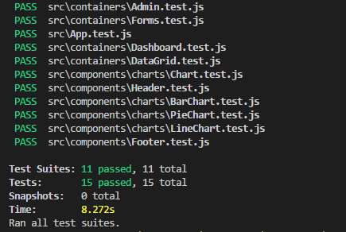
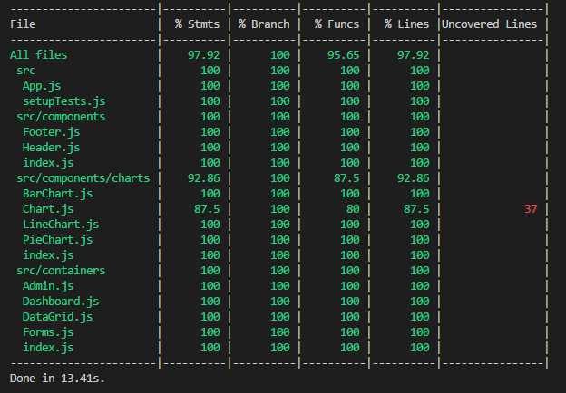

# React Admin Demo
This is an example project that demonstrate the idea of using React following the guideline and practices from the [`create-react-app` guide](https://github.com/facebook/create-react-app/blob/master/packages/react-scripts/template/README.md)

Demo: https://haitlc.github.io/react-admin-demo/

## This example includes:
- Responsive layout by [react-bootstrap](https://github.com/react-bootstrap/react-bootstrap/)
- Unit test examples with [Jest](https://github.com/facebook/jest) and [Enzyme](https://github.com/airbnb/enzyme)
- Static type checking with [Flow](https://github.com/facebook/flow)
- Style management using CSS-in-JS library, [styled-components](https://github.com/styled-components/styled-components)
- UI component development environment using [Storybook](https://storybook.js.org/)
- Code formatting using [Prettier](https://github.com/prettier/prettier)
- CICD support 

## Run 
Install dependencies
```
yarn
```

Start
```
yarn start
```

Browse http://localhost:3000


## Storybook
```
yarn storybook
```

browse http://localhost:9001/


## Unit test
Run in watch mode
```
yarn test
```


Test Coverage
```
yarn test --coverage
```



## Format code
The format configuration is in `/.prettierrc`.
You may need to install this [Visual Studio Code plugin](https://marketplace.visualstudio.com/items?itemName=esbenp.prettier-vscode) first, and press `Alt+Shift+F` to format the code.


# CICD support
Demonstration here is by Travis CI, similar approach can be done on other CI servers (e.g. Jenkins)


